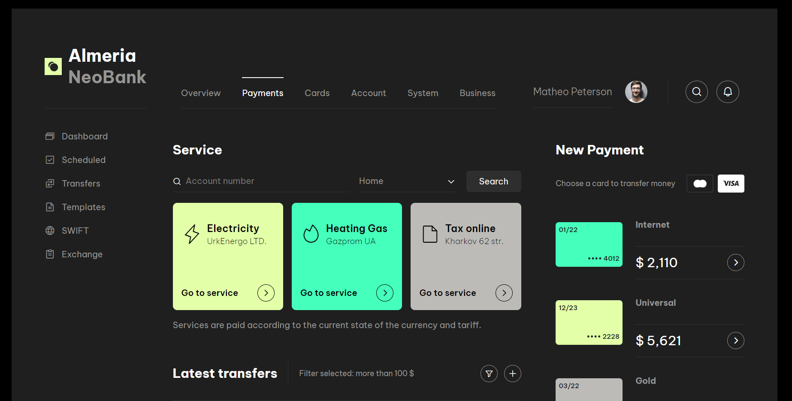

# UI Layout

This app showcases how to use Material UI components like Text, Icon, Image & ListView in a Stateless Widget.

## Table of Contents

- [Installation](#installation)
- [Screenshots](#screenshots)
- [Credits](#credits)

## Installation

## Screenshots

